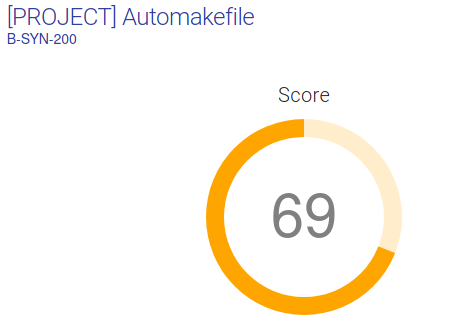

# Automakefile
SYN_automakefile_2018 - Epitech Project during the Synthesis pool 

# Usage

$ ./automakefile fakeProj1/config

# Result:

0 - requirement - 100% - 1/1 ||
1 - Makefile generation - 87,5% - 7/8 ||
2 - make & make re - 50% - 3/6 ||
3 - clean & fclean - 83,3% - 5/6 ||
4 - Version manager - 0% - 0/4 ||
5 - Error management - 100% - 4/4 ||
